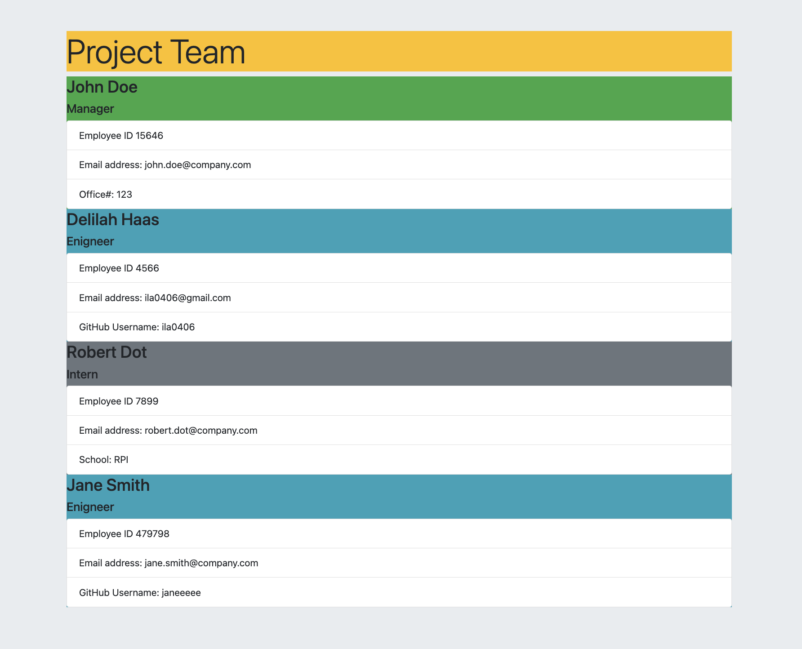
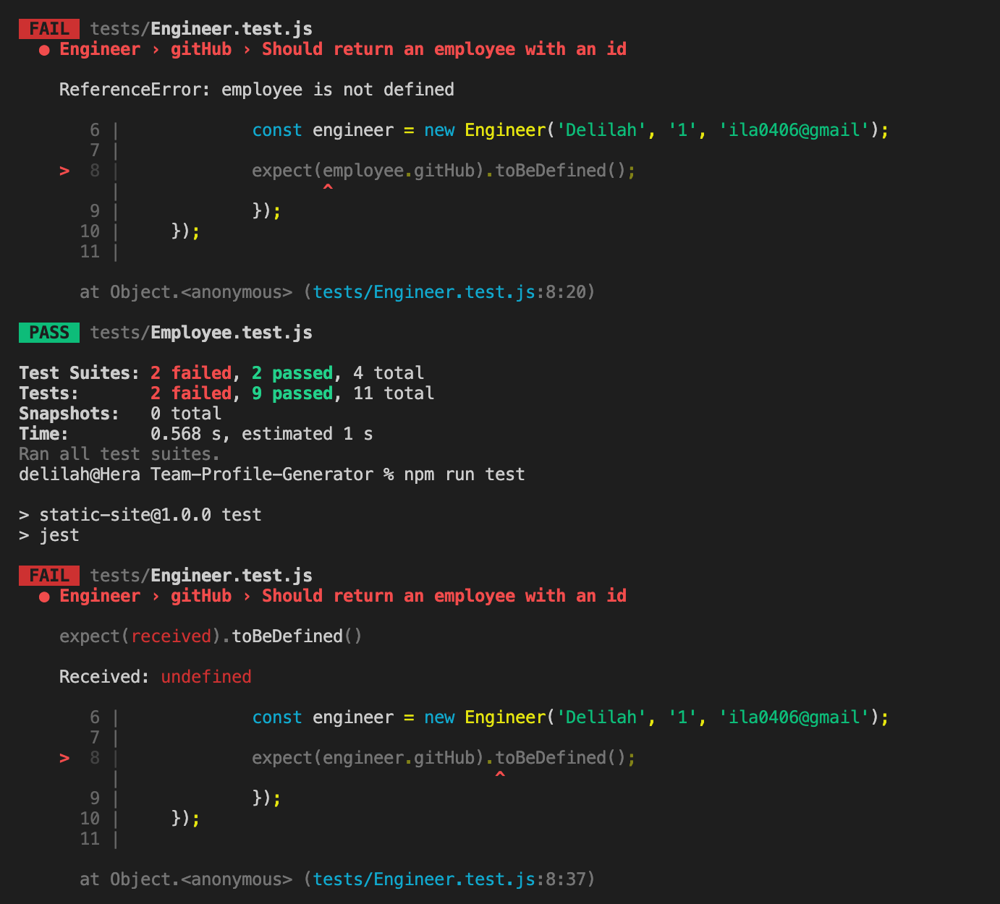
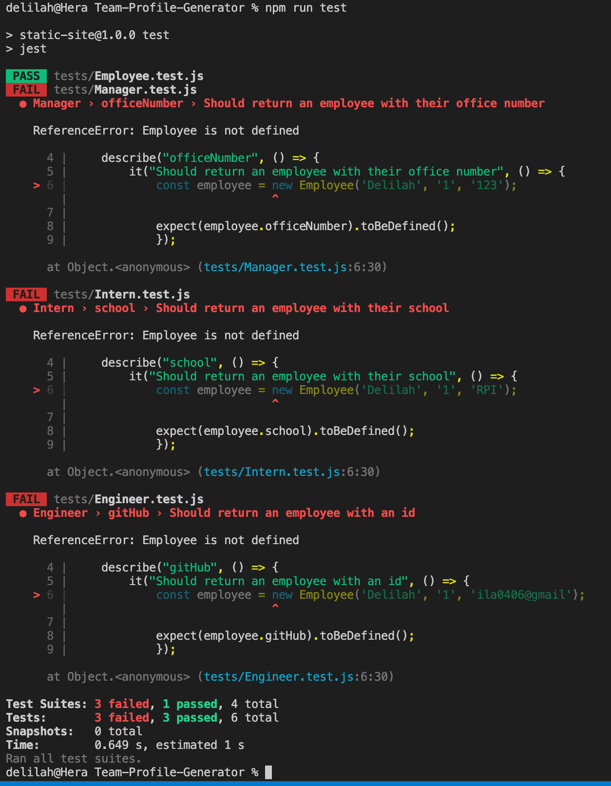
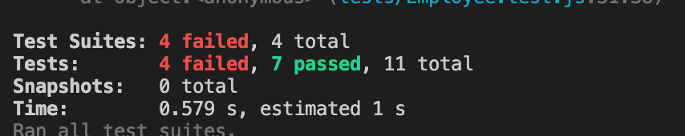
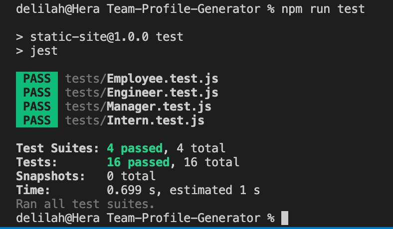

# Team Profile Generator

## Google Drive 
* Walkthrough viedo and HTML generated in example 
* https://drive.google.com/drive/folders/1WbMX2jFgj_26kMfgA3qzcNVi1KMZRXgX

## GitHub Repository
* https://github.com/ila0406/Team-Profile-Generator

## 
* [Description](#description)
* [Technolgies Used](#technolgies-used)
* [Installation Instructions](#installation-instructions)
* [Usage Info](#usage-info)
* [Contribution Guide](#contribution-guide)
* [Instructions for testing](#instructions-for-testing)
* [Questions](#questions)
* [Screenshots](#screenshots) 

## 
The team profile generator prompts the user to answer a series of questions. Starting with the role of the employee than moving on to name, email, etc, before outputting all the results to a webpage.

## 
* Javascript
* HTML
* Bootstrap
* node.js
* Jest
* Inquirier

## 
1. Run > npm i  to install node packages 
2. Run > npm run test to confirm all Jest tests 
3. Run > node index.js to start inquirier 
4. Answer questions 
5. Open generated html file in browser 

## 
1. Run > npm i  to install node packages 
2. Run > npm run test to confirm all Jest tests

## 
Started with code from hw 9 assigment which was partially provided to by DU and recived help from tutor Lilo

## 
run > npm run test to run the 4 included test suites

## 

### Mockup

### JestTesting

## 
If you have questions, you can either open a issue in my Github repository  
GitHub: <https://github.com/ila0406>  
 
Or you can send me an email directly  
Email: <ila0406@gmail.com>
